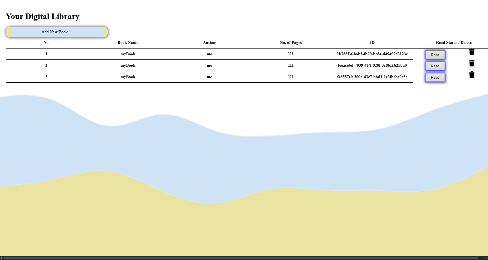

# library-app

# 📚 Library App — Personal Book Manager

A responsive and expandable library app that lets users add, track, and manage their personal book collection. Built using clean JavaScript with object constructors and array storage, the app features beautiful transitions, delete animations, and both form & internal validation.

---

## 🌐 Live Demo

🔗 [View Site](https://44RY4N.github.io/library-app/index.html)

---

## 🖼️ Preview

 <!-- Update path if needed -->

---

## 🛠️ Tech Stack

- **HTML5** – Semantic structure
- **CSS3** – Smooth transitions, consistent theming, and animations
- **JavaScript (ES6)** – Objects, constructors, DOM manipulation, dynamic rendering
- **SVG + PNG Assets** – Custom background and icons

---

## 🔍 Features

- 🧱 **Object-Oriented Design**: Books are stored as objects in an array using constructors
- ➕ **Add Books**: Fully functional form with HTML5 + internal JavaScript validation
- ✅ **Validation Alerts**: Prevents empty/incomplete submissions with user-friendly alerts
- ❌ **Delete Books**: Includes wiggle animation on hover and confirmation logic
- 🧊 **Blur Effect on Hover**: Focus on selected card while blurring others for polished UX
- 🎨 **Consistent Theme**: Carefully chosen colors and background visuals
- ♻️ **Expandable Storage**: Scalable logic allows future enhancements like localStorage

---

## 🗂️ Project Structure

library-app/                                                                                                                
├── index.html                                                                                                                                         
├── style.css                                               
├── script.js                                                               
├── img/                                                                     
│ ├── l1.png 
│ ├── l2.png                                                                                   
│ └── l11.png                                                                                
└── README.md                                                                                       

---

## 🧠 Lessons Learned

- Used **object constructors** and arrays for efficient book data storage
- Learned to build **dynamic card layouts** with DOM methods
- Implemented **form validation** via both native attributes and JavaScript
- Focused on **UX improvements** like animation and hover effects
- Debugged minor logic bugs for better reliability

---

## 🚀 Future Enhancements

- 💾 Save books to localStorage or backend API
- 📊 Filter/sort/search by author, read status, or title
- 🌙 Add dark mode toggle
- ✨ Drag & drop reordering of book cards

---

## 🤝 Acknowledgments

This project was developed as part of [The Odin Project](https://www.theodinproject.com/) curriculum for mastering JavaScript fundamentals.

---

## 📬 Contact

Created with ❤️ by [44RY4N](https://github.com/44RY4N)  
If you like the project, feel free to ⭐ the repo!
